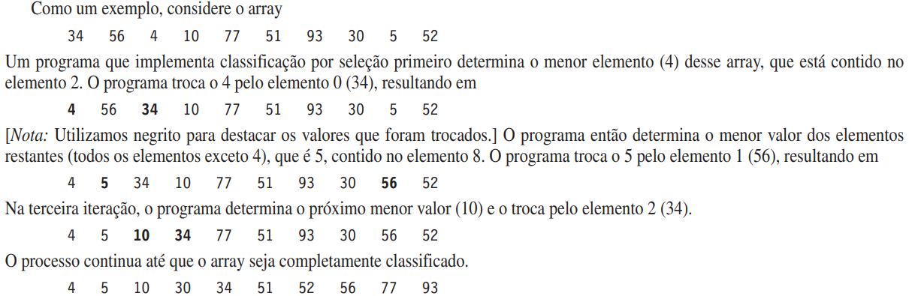
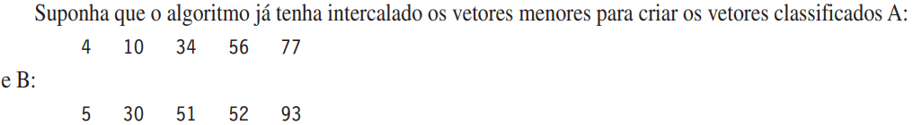
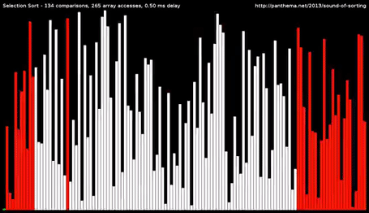
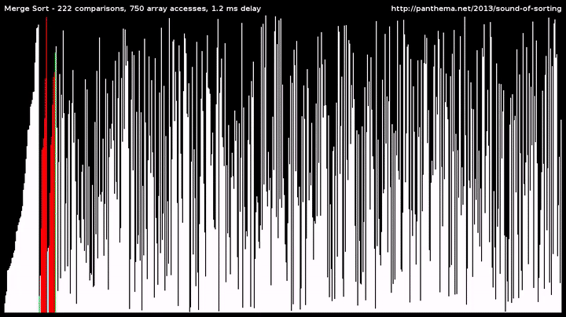

# Chaves de Classificação

### Título do Seminário
- Clasificação de dados com base em chaves de classificação (**SelectionSort**, **MergeSort**). Demonstração da eficiência do algoritmo.

### Detalhes Técnicos
- Seminário de Técnicas de Programação [Período 2020.0] - UFCG;

### Membros envolvidos no seminário

1. **Alysson Machado**;
2. **Marcus Vinícios**;
3. **Nathan Ferreira**;
4. **Iago Miguel**;

### Slide de Apresentação
- <a href = "https://github.com/Alyssonmach/chaves-de-classificacao/blob/main/apresentacao.pdf" target = "_blank">(Visualize os slides)</a>;
- [(Baixe os slides)](https://github.com/Alyssonmach/chaves-de-classificacao/raw/main/apresentacao.pdf);

### Códigos de Implementação 
- <a href = "https://github.com/Alyssonmach/chaves-de-classificacao" target = "_blank">(Visualize os códigos)</a>;
- [(Baixe os códigos)](https://github.com/Alyssonmach/chaves-de-classificacao/archive/main.zip);

### Objetivos

- Implementação dos algoritmos de classificação **SelectionSort** e **MergeSort**;
- A determinar a **eficiência dos algoritmos** de classificação; [Código](https://github.com/Alyssonmach/chaves-de-classificacao/tree/main/Parte%204%20-%20Aplica%C3%A7%C3%B5es/Demonstra%C3%A7%C3%A3o%20da%20Efici%C3%AAncia)
- Aplicar os métodos de ordenação em um exemplo com lista de Vector; [Código](https://github.com/Alyssonmach/chaves-de-classificacao/tree/main/Parte%204%20-%20Aplica%C3%A7%C3%B5es/Exemplo%20com%20listas)

### Introdução

Classificar coloca os dados na ordem, em geral ascendente ou descendente, com base em uma ou mais chaves de classificação. Uma lista de nomes poderia ser classificada alfabeticamente, contas bancárias poderiam ser classificadas pelo número de conta, registros de folha de pagamento de funcionários poderiam ser classificados pelo CIC e assim por diante.  

### Classificação por seleção (SelectionSort) [Código](https://github.com/Alyssonmach/chaves-de-classificacao/tree/main/Parte%200%20-%20SelectionSort)

A primeira iteração do algoritmo seleciona o menor elemento no array e o troca pelo primeiro elemento. A segunda iteração seleciona o segundo menor elemento (que é o menor dos elementos restantes) e o troca pelo segundo elemento. O algoritmo continua até que a última iteração selecione o segundo maior elemento e permute-o pelo penúltimo índice, deixando o maior elemento no último índice. Depois da i-ésima iteração, os i menores itens do array serão classificados pela ordem crescente nos primeiros i elementos do array.

### Exemplo de uso do SelectionSort

> Exemplo da execução do algoritmo SelectionSort em um vetor

Observe que, depois da primeira iteração, o menor elemento estará na primeira posição. Depois da segunda iteração, os dois menores elementos estarão na ordem nas duas primeiras posições. Depois da terceira iteração, os três menores elementos estarão na ordem nas três primeiras posições.

### Classificação por intercalação (MergeSort) [Código](https://github.com/Alyssonmach/chaves-de-classificacao/tree/main/Parte%201%20-%20MergeSort)

A classificação por intercalação é um algoritmo de classificação eficiente, porém conceitualmente mais complexo que a classificação por seleção e a classificação por inserção. O algoritmo de classificação por intercalação classifica um vetor dividindo-o em dois subvetores do mesmo tamanho, classificando cada subvetor e, então, mesclando-os em um vetor maior. Com um número ímpar de elementos, o algoritmo cria os dois subvetores de tal maneira que um deles tenha um elemento a mais que o outro.

### Exemplo de uso do MergeSort

A implementação da classificação por intercalação nesse exemplo é recursiva. O caso básico é um vetor com um elemento. Um vetor de um elemento está naturalmente classificado, assim a classificação por intercalação retorna imediatamente quando é chamada com um vetor de um elemento. O passo de recursão divide um vetor de dois ou mais elementos em dois subvetores do mesmo tamanho, classifica recursivamente cada subvetor, e então os mescla em um vetor classificado maior. [Novamente, se houver um número ímpar de elementos, um subvetor é um elemento maior que o outro.]

> exemplo de execução do algoritmo MergeSort em um vetor

A classificação por intercalação combina esses dois vetores em um vetor classificado maior. O menor elemento em A é 4 (localizado no zero-ésimo índice de A). O menor elemento em B é 5 (localizado no zero-ésimo índice de B). A fim de determinar o menor elemento no maior vetor, o algoritmo compara 4 e 5. O valor em A é menor, assim 4 torna-se o primeiro elemento no vetor intercalado. O algoritmo continua comparando 10 (o segundo elemento em A) com 5 (o primeiro elemento em B). O valor de B é menor, portanto 5 torna-se o segundo elemento no maior vetor. O algoritmo continua comparando 10–30, com 10 tornando-se o terceiro elemento no vetor e assim por diante.

### Eficiência de classificação por seleção (SelectionSort)

O algoritmo de classificação por seleção itera n – 1 vezes, colocando a cada passagem o menor elemento restante em sua posição classificada. Localizar o menor elemento restante requer n – 1 comparações durante a primeira iteração, n – 2 durante a segunda iteração e, então, n – 3, … , 3, 2, 1. Isso resulta em um total de n(n – 1) / 2 ou (n² – n)/2 comparações. Na notação O, os menores termos são eliminados e as constantes são ignoradas, deixando um O final de O(n²).

> Visualizando o funcionamento do SelectionSort

### Eficiência de classificação por intercalação (MergeSort)

A classificação por intercalação é um algoritmo muito mais eficiente que a classificação por seleção. Considere a primeira chamada (não recursiva) à função sortSubVector. Isso resulta em duas chamadas recursivas à função sortSubVector em que cada subvetor apresenta aproximadamente a metade do tamanho do vetor original e uma única chamada à função merge. Essa chamada à função merge exige, no pior dos casos, n – 1 comparações para preencher o vetor original, que é O(n). (Lembre-se de que cada elemento no vetor é escolhido comparando um elemento a partir de cada um dos subvetores.) As duas chamadas à função sortSubVector resultam em mais quatro chamadas recursivas à função sortSubVector, cada uma com um subvetor de aproximadamente um quarto do tamanho do vetor original, junto com duas chamadas à função merge. Cada uma dessas duas chamadas à função merge exige, no pior dos casos, n/2 – 1 comparações, para um número total de comparações de O(n). Esse processo continua, e cada chamada a sortSubVector gera duas chamadas adicionais a sortSubVector e uma chamada a merge, até que o algoritmo tenha dividido o vetor em subvetores de um elemento. Em cada nível, O(n) comparações são exigidas para intercalar os subvetores. Cada nível divide o tamanho dos vetores pela metade, portanto dobrar o tamanho do vetor exige mais um nível. Quadruplicar o tamanho do vetor exige mais dois níveis. Esse padrão é logarítmico e resulta em log2 n níveis. Isso resulta em uma eficiência total de O(n log n). 

> Visualizando o funcionamento do MergeSort

